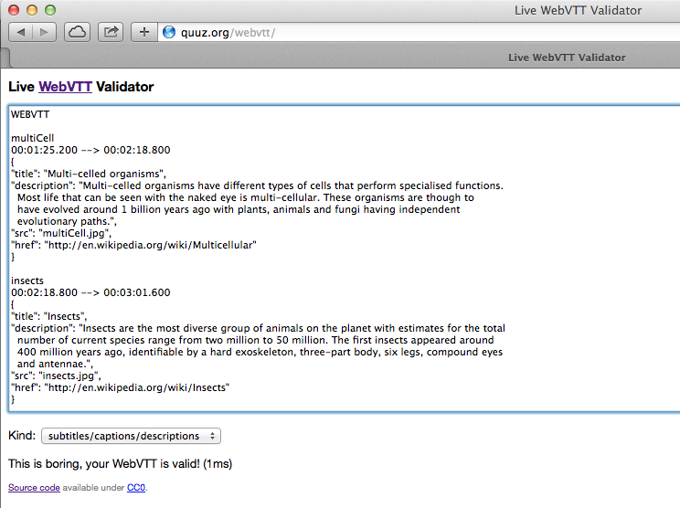

## Introducing VTT

WebVTT (Web Video Text Tracks), formerly known as WebSRT, is a W3C community proposal for synchronized video caption playback. It is a time-indexed file format and it is referenced by HTML5 video **and** audio elements.

As with many assistive technologies, it would be a mistake to assume that they are only meant as a way to provide for accessibility accomodations. We can enable captions when the ambient noise is too loud to listen to a recorded presentation, we can use chapters to navigate through a long lecture video just like DVD or Blue Ray movies.

Captions can also improve our movies' discoverability. Google indexes the content of our captions. Both YouTube and Google search can report results based on the video captions available for a given file. 

WebVTT files provide open captions, independent of the audio or video files they are attached to, they are not "hard coded" into pixels. This also means that creating VTT files requires nothing more than a text editor; although there are more specialized tools to create the captions. 

## Browser support

Based on Silvia Pfeiffer's [post to the VTT community group](http://www.w3.org/community/texttracks/2012/08/23/webvtt-support-in-browsers/) dated August, 2012, and updated with new information about Firefox, the following browsers support VTT tracks for video and audio:

</head>
<body>
<table>
  <thead>
    <tr>
      <th>Browser</th>
      <th>Version First Supported</th>
      <th>Format Supported</th>
      <th>Notes</th>
    </tr>
  </thead>
  <tbody>
    <tr>
      <td>Internet Explorer</td>
      <td>IE 10 Developer Preview 4</td>
      <td>VTT and TTML</td>
      <td>
        <ul>
          <li><a href="http://ie.microsoft.com/testdrive/Graphics/VideoCaptions/">Test Page</a></li>
          <li><a href="http://html5labs.interoperabilitybridges.com/prototypes/video-captioning/video-captioning/info">Documentation</a></li>
          <li><a href="http://ie.microsoft.com/testdrive/Graphics/CaptionMaker/">HTML5 Video Caption Maker</a></li>
          <li><a href='http://msdn.microsoft.com/library/ie/bg123962.aspx'>Timed Text Track Information</a></li>
          <li><a href='http://samples.msdn.microsoft.com/iedevcenter/TextTrack/default.html'>Timed Text Tracks</a> examples</li>
        </ul>
      </td>
    </tr>
    <tr>
      <td>Google Chrome</td>
      <td>Version 18</td>
      <td>VTT</td>
      <td>
        <ul>
          <li>Basic tutorial hosted at <a href="http://www.html5rocks.com/en/tutorials/track/basics/">HTML5 Rocks</a></li>
          <li>Based on Webkit's implementation</li>
        </ul>
      </td>
    </tr>
    <tr>
      <td>Apple Safari</td>
      <td>Version 6</td>
      <td>VTT</td>
      <td>
        <ul>
          <li>Based on Webkit's implementation</li>
        </ul>
      </td>
    </tr>
    <tr>
      <td>Opera</td>
      <td>Since August, 2012</td>
      <td>VTT</td>
      <td>
        <ul>
          <li>Documentation at <a href="http://dev.opera.com/articles/view/an-introduction-to-webvtt-and-track/">dev.opera</a></li>
        </ul>
      </td>
    </tr>
    <tr>
      <td>Firefox</td>
      <td>Nightly</td>
      <td>VTT</td>
      <td>
        <ul>
          <li>Tested with version 29.0a1 (12/14/2013)</li>
          <li>Feature enabled by default</li>
          <li>See the <a href="https://developer.mozilla.org/en-US/docs/HTML/WebVTT">Mozilla Developer Documentation</a> for more information</li>
          <li>If the size of the video doesn't match the size attributes of the video tag, the video will display on white/gray background</li>
        </ul>
      </td>
    </tr>
  </tbody>
</table>

## Polyfills and alternatives

I will use one of the many polyfils available for HTML5 Video Tracks. [Playr](http://www.delphiki.com/html5/playr/) seems to be the most feature complete polyfill for HTML5 video tracks. The downside is 2 more files (one CSS and one JavaScript) to download for the video page but until VTT is widely supported the extra files are worth the effort to create accessible content. 

One way to ensure that we only load our polyfill if the browser doesn't support tracks natively is to use Modernizr.load to conditionally load Playr's CSS and JavaScript when the browser does not support HTML5 video tag natively. 

<pre><code>Modernizr.load([
 {
    // test whether we support video
    test : Modernizr.video,
    // Load the corresponding assetts for the polyfill you want to use
    // in this case we are using the playr polyfill
    nope : ['playr.js', 'playr.css']
  },
])</code></pre>

The code below uses plain JavaScript to test if a browser supports  HTML5 video by creating an empty video element and testing for the video's canPlayType property. It will not load the code for a polyfill like the Modernizr example.

<pre><code>var canPlay = false;
  var h, plink, pscript;

  // Create an empty video element
  var v = document.createElement('video');
  // If the video can playType and can play MP4 video
  if(v.canPlayType) {
    // Set canPlay to true
    canPlay = true;
    // Display an alert telling them so
    alert('Can Play HTML5 video')
  }
  else {
    // Append Playr CSS and JS to the head of the page to
    // provide a fallback
    h = document.getElementsByTagName('head')[0];
    plink = document.createElement('link');
    plink.setAttribute('href', 'css/playr.css');
    plink.setAttribute('media', 'screen');
    h.appendChild(plink);
    pscript = document.createElement('script');
    pscript.setAttribute('src', 'js/playr.js');
    h.append('pscript');
  }</code></pre>

This is the simplest test for video support; a more elaborate version can include support for specific formats and write the <code>&lt;source&gt;</code> tags only for the supported formats. The example below makes the following assumptions:

* You have encoded a video in all three formats (webm, mp4 and ogg)
* You are testing for support for HTML5 video in general and specific formats
* If HTML5 video is not supported you have a flash-based fallback solution

<pre><code>var canPlay = false;
  // Get the video by selecting the video tag
  var v = document.getElementsByTagName('video');
  // Optionally add video attribtues as needed
  // At a minimum set height, width and controls
  // as shown below
  v.setAttribute('height', '640');
  v.setAttribute('width', '480');
  v.setAttribute('control', 'control');

  // If the video can playType and can play MP4 video
  if (v.canPlayType &amp;&amp; v.canPlayType('video/webm'; codecs="vp8, vorbis"').replace(/no/, '')){
    // append the appropriate source track
    var webm = v.appendChild(source);
    webm.setAttribute("source", "myvideo.webm");
    webm.setAttribute("type", "video/webm");
  }
  else if (v.canPlayType &amp;&amp; v.canPlayType('video/mp4; codecs="avc1.42E01E, mp4a.40.2"').replace(/no/, '')){
    // append the appropriate source track
    var mp4 = v.appendChild(source);
    mp4.setAttribute("source", "myvideo.mp4");
    mp4.setAttribute("type", "'video/mp4; codecs="avc1.42E01E, mp4a.40.2"'");    
  }</code></pre>

Also note that we're testing for specific audio and video codec combinations. WebM supports a single combination of video and audio codecs but MP4 supports multiple profiles, not all of which are supported in HTML5 video. See <http://mpeg.chiariglione.org/faq/what-are-different-profiles-supported-mpeg-4-video> for an introduction to the different profiles supported by MPEG4. 

### Players and Polyfills

Playr is by no means the only polyfil or the only player that supports VTT. It is the one that I found the most feature complete for what I needed. The selection below represents a set of players and polyfills available.

* [video.js player](http://videojs.com/docs/tracks/)
* [jwplayer](http://www.longtailvideo.com/addons/plugins/84/Captions)
* [MediaElementJS player](http://mediaelementjs.com/)
* [LeanBack player](http://leanbackplayer.com/)
* [js_videosub polyfill](http://www.storiesinflight.com/js_videosub/)
* [Captionator polyfill](https://github.com/cgiffard/Captionator)
* [vtt.js](https://github.com/mozilla/vtt.js) by the Mozilla Foundation

## Different types of VTT tracks and their structures

### Captioning Tracks

> Captioning is text that appears on a video, which contains dialogue and audio cues such as music or sound effects that occur off-screen. The purpose of captioning is to make video content accessible to those who are deaf or hard of hearing, and for other situations in which the audio cannot be heard due to noise or a need for silence.

> Captions can be either open (always visible, aka "burned in") or closed, but closed is more common because it lets each viewer decide whether they want the captions to be turned on or off. 

> From <http://www.cpcweb.com/faq/>

The simplest and most often used type of text track, captions provide alternative text content for people with visual dissabilities, for people who choose to play the video without audio, and others.

Depending on the player you may have open captions, where the captions are always visible on screen,  or closed captions where you have to manually activate the display of captions; Either open or closed, the captions are independent of the content they are attached to. 

<pre><code>WEBVTT (1)

railroad (2)
00:00:10.000 --> 00:00:12.500 (3) [Optional Settings] (4)
Left uninspired by the crust of railroad earth (5)

manuscript
00:00:13.200 --> 00:00:16.900
that touched the lead to the pages of your manuscript.
</code></pre>

**Explanation of the cue above:**

1. WEBVTT must be the first item on the file, on the first line and in a line of its own. It must be followed by a blank line
2. The name of the cue 
3. Immediately below the name of the cue come the beginning and end time for the cue expressed in hours:minutes:seconds:milliseconds format. **Hours, Minutes and Seconds must have 2 digits and be padded with zeros if necessary. Miliseconds must have 3 digits and be zero padded if not long enough**
4. Optional Cue Settings separated from the time one or more SPACE or TAB characters
5. The text for the cue

### Subtitles Tracks

Subtitle Tracks are similar to Caption Tracks but are not meant to address accessibility issues as Captions are. Subtitle tracks are used primarily to convey the dialogue in a language other than the one being spoken in the video. Take, for example a Japanese movie where the subtitles translate the content to English. 

Subtitles are not expected to convey additional non-verbal cues. Once again, are only meant to provide a translation of the content being played although some delivery formats such as Blue Ray do not follow this recommendation. 

**What's the difference between captions and subtitles?**

> The main difference is that subtitles usually only transcribe the spoken dialog, and are mainly aimed at people who are not hearing impaired, but lack fluency in the spoken language. Closed captions are aimed at the deaf and hearing impaired, who need additional non-verbal audio cues (such as "[GUN SHOT]" or "[SPOOKY MUSIC]") to be transcribed in the text. Closed captions are also useful for situations in which video is being shown but the sound is muted or difficult to hear, such as for a noisy bar, convention floor, video signage &amp; billboards, etc.

> Subtitles which also contain these non-verbal cues are usually referred to as "SDH" (Subtitles for the Deaf and Hard of hearing) tracks, but for various reasons, closed captions are usually the preferred method of making video accessible for the deaf and hearing impaired. SDH subtitles tend to be used on video formats that do not support closed captioning, such as Blu-ray discs.

> From <http://www.cpcweb.com/faq/>

Other than the content for each type of track, HTML5 video structures the track element the same way. In the example below, the only difference are the <code>kind</code> attributes for each track. 

<pre><code>&lt;!-- This is the captions track --&gt;
&lt;track kind="captions" lang="en" srclang="en" label="English" src="sintel.vtt" /&gt;
&lt;!-- This is the subtitles track for Spanish --&gt;
&lt;track kind="subtitles" lang="es" srclang="es" label="Espa&ntilde;ol" src="sintel-es.vtt" /&gt;
</code></pre>

### Chapter Tracks

Chapter tracks help you navigate through the video by associating certain "chapters" with time codes. This will let you navigate to different sections of your video using some sort of visual cue.

In the example below, chapter 1 is 10 second long and titled Introduction to HTML5. 

<pre><code>WEBVTT (1)

Chapter 1 (2)
00:00:01.000 --> 00:00:10.000 (3)
Introduction to HTML5(4)

Chapter 2
00:00:10.001 --> 00:00:15.000
Introduction to HTML5</code></pre>

**Explanation of the chapter above:**

1. WEBVTT must be the first item on the file, on the first line and in a line of its own. It must be followed by a blank line
2. The name of the chapter 
3. Immediately below the name of the chapter come the beginning and end time expressed in hours:minutes:seconds:milliseconds format. **Hours, Minutes and Seconds must have 2 digits and be padded with zeros if necessary. Miliseconds must have 3 digits and be zero padded if not long enough**
4. The title of the chapter

### Description Tracks

Description tracks are used primarily as an assistive technology helper, these tracks will be readby assistive technology devices. The cues can be arbitrarily long as long as they don't contain empty lines (they would signal the beginning of a new cue)

<pre><code>VTT - Description for Sintel trailer

Sintel's Search -- begning of the search
00:00:01.000 --> 00:00:52.000
Woman walks up a mountain
Fights an unknown man
Smoking man (covering full frame) speaks
Little dragon flies towards the woman before a larger dragon snatches it and flies away. The woman screams trying to grab the smaller flying creature</code></pre>

### Metadata Tracks

Metadata Tracks are used to convey any additional information (such as base64 encoded images, JSON, additional text or any additional text-based file format) the developer needs to include in the page based on time indexes. A web app can listen for cue events, extract the text of each cue as it fires, parse the data and then use the results to make DOM changes (or perform other JavaScript or CSS tasks) synchronised with media playback.

<pre><code>WEBVTT - Example metadata track containing JSON payload

multiCell
00:01:15.200 --> 00:02:18.800
{
"title": "Multi-celled organisms",
"description": "Multi-celled organisms have different types of cells that perform specialised functions.
  Most life that can be seen with the naked eye is multi-cellular. These organisms are though to have evolved around 1 billion years ago with plants, animals and fungi having independent evolutionary paths.",
"src": "multiCell.jpg",
"href": "http://en.wikipedia.org/wiki/Multicellular"
}

insects
00:02:18.800 --> 00:03:01.600
{
"title": "Insects",
"description": "Insects are the most diverse group of animals on the planet with estimates for the total
  number of current species range from two million to 50 million. The first insects appeared around
  400 million years ago, identifiable by a hard exoskeleton, three-part body, six legs, compound eyes
  and antennae.",
"src": "insects.jpg",
"href": "http://en.wikipedia.org/wiki/Insects"
}</code></pre>

We can then use Javascript to parse the track content and do something with the track's content. 

<pre><code>textTrack.oncuechange = function (){
  // "this" is a textTrack
  var cue = this.activeCues[0]; // assuming there is only one active cue
  var obj = JSON.parse(cue.text);
  // do something
}</code></pre>

## Building the tracks
We can build our caption file using the text above as an example, and this is the most common way to caption a video for accessibility.

We can also build multiple caption tracks as well as a variety of other tracks. Most polyfills will support a subset of the full VTT specification, Playr, the polyfill I've selected for these examples, supports captions, descriptions and chapter tracks. 

## Getting the captions to work

### Building the tracks

(built with information from <http://demosthenes.info/blog/584/Creating-And-Validating-WebVTT-Subtitles>)

There are no programs that natively support VTT as a captioning program. However there are plenty of programs that will create SRT captions, which is very similar to VTT (we'll discuss the differences later in this section). 

Choose whatever tool will work best for you to generate the SRT file; then follow the instructions below to convert them to VTT files. 

#### Converting SRT to VTT

Due to their close relationship, conversion from .srt into .vtt is very simple. A typical .srt file will look something like this:

<pre><code>1
00:01:21,700 --> 00:01:24,675
Life on the road is something
I was raised to embrace.</code></pre>

The process is little more than a find-and-replace:

* Add WEBVTT to the first line of the file
* Convert the comma before the millisecond mark in every timestamp to a decimal point
* Add styling markup to the subtitle text if needed

The resulting VTT file will look like this: 

<pre><code>WEBVTT

Life
01:21.700 --> 01:24.675
Life on the road is something
I was &lt;i&gt;raised&lt;/i&gt; to embrace.</code></pre>

Save the file with a .vtt extension and link to it from a <code>&lt;track&gt;</code> element in your video.

#### Validating A VTT File

It is not hard to make mistakes when creating a VTT track fille. Fortunately there is an [online validator](http://quuz.org/webvtt/) to help with authoring.

It is essentially a two step process:

- Paste the text of your VTT file
- Select the type of track you're working on

The results will automatically display 
#### Optional Cue Settings

Cues can also be styled and moved around the screen relative to the borders of the video. The table below summarizes the settings avalable for cues. 

##### Vertical Alignment

> Name: vertical

> Values: <code>rl</code> (right to left) - <code>lr</code> (left to right)

> What is used for: Vertical text alignment for languages like Japanese that can be read from top to bottom

> Example: vertical:lr (makes the cue display vertically from left to right)

##### Line Placement

> Name: line

> Value [-][0 or larger] (negative or possitive number)

> What is used for: References a particular line number that the cue is to be displayed on. 

> * Line numbers are based on the size of the first line of the cue. 

> * A negative number counts from the bottom of the frame

> * Positive numbers from the top

##### Top Alignment

> Name: line

> value [0-100]%

> What is used for: Percentage value indicating the position relative to the top of the frame

> Example

> Name: position

> Value [0-100]%

> What is used for: Percentage value indicating the horizontal alignment relative to the edge of the frame where the text begins (e.g. the left edge in English)

> Example

##### Cue Box Size

> Name: size

> Value: [0-100]%

> What it's used for: Indicates the size of the cue box. The value is given as a percentage of the width of the frame

> Example

##### Text Align

> Name: align

> Values start|| middle || end

> What it's used for: Specifies the alignment of the text within the cue. The keywords are relative to the text direction and are the same alignment keywords used in SVG

> Example

**Note: if no cue settings are set, the positioning default to the middle, at the bottom of the frame.**

#### Cue Payload Tags

These are additional tracks that will allow you to customize the appearance of your tracks. ** You cannot use payload tags with chapter tracks**

##### Timestamp Tags (Karaoke Style and Paint On Caption Text)

Using timestamp tags can build Karaoke Style tracks. You build the track by inserting the correct time stamp where you want the highlighted text to change, subject to the following restrictions:

* The timestamp must be greater that the cue's start timestamp, greater than any previous timestamp in the cue payload, and less than the cue's end timestamp.

<pre><code>VTT - Example Karaoke Style Track

1
00:16.500 --> 00:18.500
When the moon &lt;00:17.500&gt;hits your eye

2
00:00:18.500 --> 00:00:20.500
Like a &lt;00:19.000&gt;big-a &lt;00:19.500&gt;pizza &lt;00:20.000&gt;pie

3
00:00:20.500 --> 00:00:21.500
That's &lt;00:00:21.000&gt;amore</code></pre>

In the example above:

* The active text is the text between the timestamp and the next timestamp or to the end of the payload if there is not another timestamp in the payload. 
* Any text before the active text in the payload is previous text . 
* Any text beyond the active text is future text. We can use the previous and future tracks to create the Kraoke experience.

And a possible CSS rule to style the content looks like this. 

<pre><code>
::cue:past { 
  color:yellow 
}

::cue:future {
  text-shadow: black 0 0 1px;
}</code></pre>

Timestamp tags can also be used for Paint On captions, which placed independently from each other and don't erase what was already on the screen. They are written one letter at a time and they appear to 'paint on' the screen.

##### Speaker Semantics

You can use a combination of cue positioning and specific markup on individual cues to further emphazise who is speaking in a given caption or subtitle where appropriate. 

<pre><code>WEBVTT - Sintel Caption File With Speaker Semantics

Sage
00:00:12.000 --> 00:00:15.000 A:middle T:10%
&lt;v.gatekeeper&gt;What brings you to the land
of the gatekeepers?

Searching
00:00:18.500 --> 00:00:20.500 A:middle T:80%
&lt;v.sintel&gt;I'm searching for someone.
</code></pre>

We can style the speaker semantic classes using CSS. For example we can add a different color for each speaker, something like the example below:

<pre><code>video::cue(v.gatekeeper) { 
  color:lime;
}

video::cue(v.sintel) { 
  color: #ff00ff; 
}</code></pre>

##### Addtional Style tags

The following tags require opening and closing tags.

**Class tag**

Style the contained text using a CSS class.

<pre><code>Cue 14 - Class tag example
&lt;c.classname&gt;text&lt;/c&gt;</code></pre>

**Italics tag**

Italicize the contained text.

<pre><code>Example 15 - Italics tag
&lt;i&gt;text&lt;/i&gt;</code></pre>

**Bold tag**

Bold the contained text.

<pre><code>Example 16 - Bold tag
&lt;b&gt;text&lt;/b&gt;</code></pre>

**Underline tag**

Underline the contained text.

<pre><code>Example 17 - Underline tag
&lt;u&gt;text&lt;/u&gt;</code></pre>

**Ruby tag**
**Ruby text tag**

Used together to display ruby characters (i.e. small annotative characters above other characters). Ruby annotations are primarily used in languages with logographic alphabets (Japanese, Chinese, Korean) where a single character may represent a complete word and where the meaning of the character may not be familiar to the reader. 

> Ruby characters are small, annotative glosses that can be placed above or to the right of a Chinese character when writing languages with logographic characters such as Chinese or Japanese to show the pronunciation. Typically called just ruby or rubi, such annotations are used as pronunciation guides for characters that are likely to be unfamiliar to the reader.

> From [Wikipedia](http://en.wikipedia.org/wiki/Ruby_character)

<pre><code>Example 18 - Ruby tag and Ruby text tag
&lt;ruby&gt;WWW&lt;rt&gt;World Wide Web&lt;/rt&gt;oui&lt;rt&gt;yes&lt;/rt&gt;&lt;/ruby&gt;</code></pre>

### Adding the tracks to the video

Either in a supported browser or using one of the polyfills available (like we've chosen to do with Playr) we add <code>&lt;track&gt;</code> elements, one for each language of captions that we make available. 

There is one non-standard attribute we will add to the video to  make it work with Playr. The code below shows what a video track looks with associated an associated caption track for English.

<pre><code>&lt;!DOCTYPE html&gt;
&lt;html&gt;
&lt;head&gt;
  &lt;title&gt;Sample Captioned Video&lt;/title&gt;
  &lt;script src="playr.js"&gt;&lt;/script&gt;
  &lt;link rel="stylesheet" href="playr.js"&gt;&lt;/head&gt;
&lt;/head&gt;
&lt;body&gt;
&lt;video 
  id="myvideo" 
  controls="controls" 
  class="playr_video" 
  width="640" height="480" 
  poster="http://media.w3.org/2010/05/sintel/poster.png" 
&gt;
&lt;!-- 
  These are the three sources. This should cover most of our 
  deployed player base
--&gt;
&lt;source src="http://media.w3.org/2010/05/sintel/trailer.mp4" type="video/mp4" /&gt;
&lt;source src="http://media.w3.org/2010/05/sintel/trailer.webm" type="video/webm" /&gt;
&lt;source src="http://media.w3.org/2010/05/sintel/trailer.ogv" type="video/ogg" /&gt;  
&lt;!-- 
  This is the captions track
--&gt;
&lt;track kind="captions" lang="en" srclang="en" label="English" src="sintel.vtt" /&gt;
&lt;/video&gt;
&lt;/body&gt;
&lt;/html&gt;
</code></pre>

The working example is located at <http://labs.rivendellweb.net/vtt-demo/basic.html> and an example without a polyfill (meant to test native browser support) is located at <http://labs.rivendellweb.net/vtt-demo/basic-plain.html>

The same example without polyfill support and supporting captions in English and Spanish with the English caption being the default. The default attribute will also display the captions automatically

<pre><code>&lt;!DOCTYPE html&gt;
&lt;html&gt;
&lt;head&gt;
  &lt;title&gt;Sample Captioned Video&lt;/title&gt;
&lt;/head&gt;
&lt;/head&gt;
&lt;body&gt;
&lt;video 
  id="myvideo" 
  controls="controls" 
  width="640" height="480" 
  poster="http://media.w3.org/2010/05/sintel/poster.png" 
&gt;
&lt;!-- 
  These are the three sources. This should cover most of our 
  deployed player base
--&gt;
&lt;source src="http://media.w3.org/2010/05/sintel/trailer.mp4" type="video/mp4" /&gt;
&lt;source src="http://media.w3.org/2010/05/sintel/trailer.webm" type="video/webm" /&gt;
&lt;source src="http://media.w3.org/2010/05/sintel/trailer.ogv" type="video/ogg" /&gt;  
&lt;!-- 
  This is the captions track
--&gt;
&lt;track kind="captions" lang="en" srclang="en" label="English" src="sintel-en.vtt" default /&gt;
&lt;track kind="captions" lang="es" srclang="es" label="Spanish" src="sintel-es.vtt" /&gt;
&lt;/video&gt;
&lt;/body&gt;
&lt;/html&gt;
</code></pre>

The final example contains multiple caption tracks, subtitles in Spanish and descriptions for the video. 

<pre><code>&lt;!DOCTYPE html&gt;
&lt;html&gt;
&lt;head&gt;
  &lt;title&gt;Sample Captioned Video&lt;/title&gt;
&lt;/head&gt;
&lt;/head&gt;
&lt;body&gt;
&lt;video 
  id="myvideo" 
  controls="controls" 
  width="640" height="480" 
  poster="http://media.w3.org/2010/05/sintel/poster.png" 
&gt;
&lt;!-- 
  These are the three sources. This should cover most of our 
  deployed player base
--&gt;
&lt;source src="http://media.w3.org/2010/05/sintel/trailer.mp4" type="video/mp4" /&gt;
&lt;source src="http://media.w3.org/2010/05/sintel/trailer.webm" type="video/webm" /&gt;
&lt;source src="http://media.w3.org/2010/05/sintel/trailer.ogv" type="video/ogg" /&gt;  
&lt;!-- 
  These are the captions track
--&gt;
&lt;track kind="captions" lang="en" srclang="en" label="English" src="sintel-en.vtt" default /&gt;
&lt;track kind="captions" lang="es" srclang="es" label="Spanish" src="sintel-es.vtt" /&gt;
&lt;track kind="captions" lang="de" srclang="de" label="Spanish" src="sintel-de.vtt" /&gt;&lt;/video&gt;
&lt;!-- 
  This is the subtitles track
--&gt;
&lt;track kind="subtitles" lang="es" srclang="es" label="Subtitulos en Espa&ntilde;ol" src="sintel-es-subtitles.vtt" /&gt;
&lt;!-- 
  These are the description tracks
--&gt;
&lt;track kind="captions" lang="en" srclang="en" label="English" src="sintel-en.vtt" default /&gt;
&lt;/body&gt;
&lt;/html&gt;</code></pre>

## Text tracks and audio

Text tracks are not limited to working with just video. They work just the same with audio. The example below (taken from <http://mattcrouch.net/experiments/music-sync/>) provides synchronized captions to an audio track. 

Using jQuery, an extract of the audio for the Sintel video and the same captions that we used for the video examples, we change the cues programatically using the video API to display the cues at the matching time. 

As you can see, description tracks would be particularly useful in this case as they would provide a more complete context to the audio. 

<pre><code>jQuery(document).ready(function() {
    // Step below is optional. I don't like taking
    // the option from the user and autoplay the video
    $('audio').trigger("play"); 
    var audio = document.querySelector("audio");
    // log the name of the track we're working with
    console.log(audio.textTracks[0]);

    audio.textTracks[0].oncuechange = function (){
      $("#output").html(""); // Clear the content of our output region
        if(this.activeCues !== null) {
          for(var i=0;i<this.activeCues.length;i++) {
            if(this.activeCues[i] !== undefined) {
              $("#output").append(this.activeCues[i].text+" ");
            }
          }
        }
      }
    });</code></pre> 

** Are audio sprites appropriate for this doc? **

<!--
Another, somewhat way to work with audio using VTT and the web API is to create

<pre><code>var sfx = new Audio('sfx.wav');
var track = sfx.addTextTrack('metadata'); 

// Add cues for sounds we care about.
// TextTrackCue format:
// startTime, endTime, text
// track.addCue(new TextTrackCue(12.783, 13.612, 'dog bark')); 
// track.addCue(new TextTrackCue(13.612, 15.091, 'kitten mew'));

// function playSound(id) {
//  sfx.currentTime = track.getCueById(id).startTime;
//  sfx.play();
// }

playSound('dog bark');
playSound('kitten mew');</code></pre>
-->
## Additional Tutorials And Tools

* <http://dev.opera.com/articles/view/an-introduction-to-webvtt-and-track/>
* <https://developer.mozilla.org/en-US/docs/HTML/WebVTT>
* <http://blogs.msdn.com/b/ie/archive/2011/10/12/html5-video-captioning.aspx>
* <http://www.delphiki.com/webvtt/>
* <http://demosthenes.info/blog/580/Make-Online-Video-Accessible-And-Searchable-With-WebVTT>
* <http://www.accessiq.org/news/features/2013/03/webvtt-and-captioning-on-the-web>
* [Test Drive Video Captions](http://ie.microsoft.com/testdrive/Graphics/VideoCaptions/)
* <http://html5labs.interoperabilitybridges.com/prototypes/video-captioning/video-captioning/info>
* [Microsoft Caption Maker](http://ie.microsoft.com/testdrive/Graphics/CaptionMaker/)
* [Timed Text Track Information](http://msdn.microsoft.com/library/ie/bg123962.aspx)
* [Timed Text Tracks examples](http://samples.msdn.microsoft.com/iedevcenter/TextTrack/default.html)
